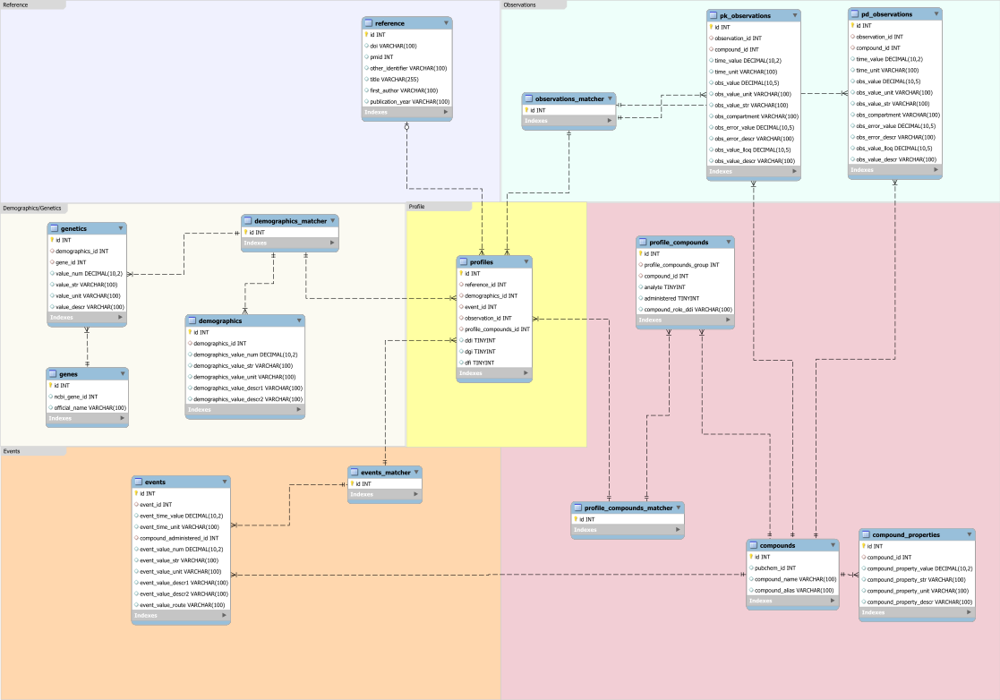

# EracoSysMed - DDGI observed data database
This is the remote repository for the EraCoSysMed DDGI observed data database.  


Schema for the database, last updated 06/30/2021.




## Setting up the REST-API
1. Install node and npm.
2. In node_restapi/server/db create a folder 'config' and in it a 'config.json' file.
3. The config.json should be formatted as follows:
    ```json
    {
        "development": {
        "host": "host_name",
        "database": "db_name",
        "user": "user_name",
        "password": "user_password",
        "port": port, default is 3306
        }
    }
    ```
4. Navigate to node_restapi and run "npm run dev"
5. To test, enter "localhost:3000/api/compound" in your browser.
